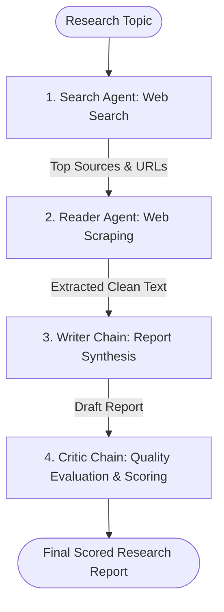

# 🔭 Scout — Your Autonomous Research Explorer

**Scout** is an end-to-end multi-agent research pipeline that conducts autonomous web investigation, deep page scraping, report synthesis, and critical peer review.

---

## 🌟 Architecture & Workflow



### 🤖 Multi-Agent Breakdown

| Agent / Chain | Function | Tools / Tech |
|---|---|---|
| **Search Agent** | Discovers recent, authoritative web sources on the input topic | `DuckDuckGo` / `Tavily`, LangChain Agents |
| **Reader Agent** | Visits and scrapes raw page content, stripping noise & scripts | `BeautifulSoup4`, `requests` |
| **Writer Chain** | Synthesizes search snippets + deep scraped content into an insightful report | Google Gemini / OpenAI, Prompt Templates |
| **Critic Chain** | Evaluates the report strictly: assigns score out of 10, lists strengths, improvements, and verdict | Structured LLM Evaluation Chain |

---

## 📁 Project Structure

```text
scout/
├── app.py              # Streamlit Web UI with real-time stage tracking
├── pipeline.py         # Sequential execution pipeline (CLI entry point)
├── agents.py           # Agent and Chain definitions (Search, Reader, Writer, Critic)
├── tools.py            # DuckDuckGo/Tavily Search and BeautifulSoup Scraping tool implementations
├── requirements.txt    # Python dependencies
└── .env.example        # Environment variable template
```

---

## 🚀 Setup & Installation

### 1. Install Dependencies
```bash
cd scout
pip install -r requirements.txt
```

### 2. Configure Environment Variables
Copy `.env.example` to `.env` and provide your API keys:
```bash
cp .env.example .env
```
Inside `.env`:
```env
GOOGLE_API_KEY=your_google_api_key
```

### 3. Run via Web UI (Streamlit)
```bash
streamlit run app.py
```

### 4. Run via CLI Pipeline
```bash
python pipeline.py
```
